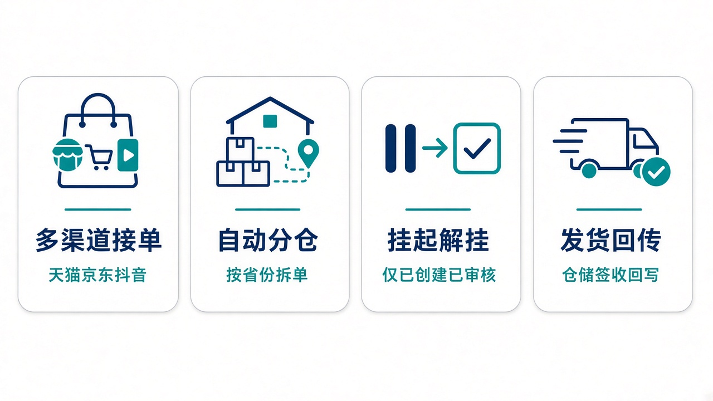
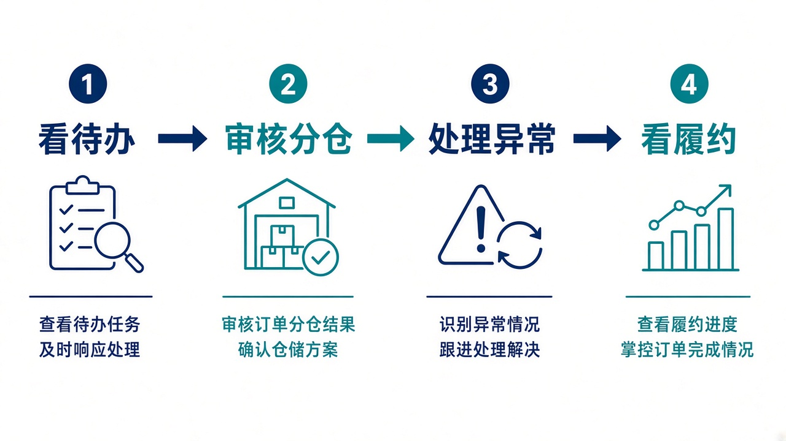

# 给大家讲：订单系统怎么用

OMS 是订单中枢。店铺和接口把单送进来，这里审核、分仓、预占，再推出库给仓储、把运单交给运输。控制塔可以挂起、加急、改仓，但订单状态以本系统为准。页面细节和亮点短表见 [项目亮点](./项目亮点.md)。

## 适合什么场景

| 场景 | 在这里怎么做 |
| --- | --- |
| 天猫、京东、抖音、线下或接口同时来单 | 走开放下单口，按店铺和渠道单号幂等，重复推送不会建第二张 |
| 一个订单要拆到多个仓 | 按省份和路由规则自动分仓，也可以手工拆 |
| 单子还没审核，先别往下走 | 挂起只接受已创建、已审核。解除挂起回到挂起前的状态 |
| 已经支付却没发货 | 不要挂起。用加急提高优先级，或到控制塔看卡在仓库还是运输 |
| 仓库发货、运输签收 | 回传写回订单，状态走到已出库、已完成 |

## 亮点

1. 一条状态机走完履约：已创建、已审核、已分配、已推仓、已出库、已完成。
2. 渠道可售和仓库库存分开算，预占、释放、扣减、退回都留流水。
3. 一键处理可以把审核、分仓、预占按规则走完。
4. 控制塔的挂起、解挂、改仓、取消、加急打到开放指令，重复点击不会连发。

## 一天怎么用

1. 打开工作台，先看待审核、待推仓和异常。
2. 审核并分仓。库存不够时先看渠道可售，不要直接把已支付的单挂起。
3. 处理挂起、取消和拆单。取消已推仓的单会释放预占，并通知仓储。
4. 看每日订单和履约时效，确认发货、签收已经回写。

管理员管用户。作业员处理订单。只读用户只看。演示账号请登录后改密码。
